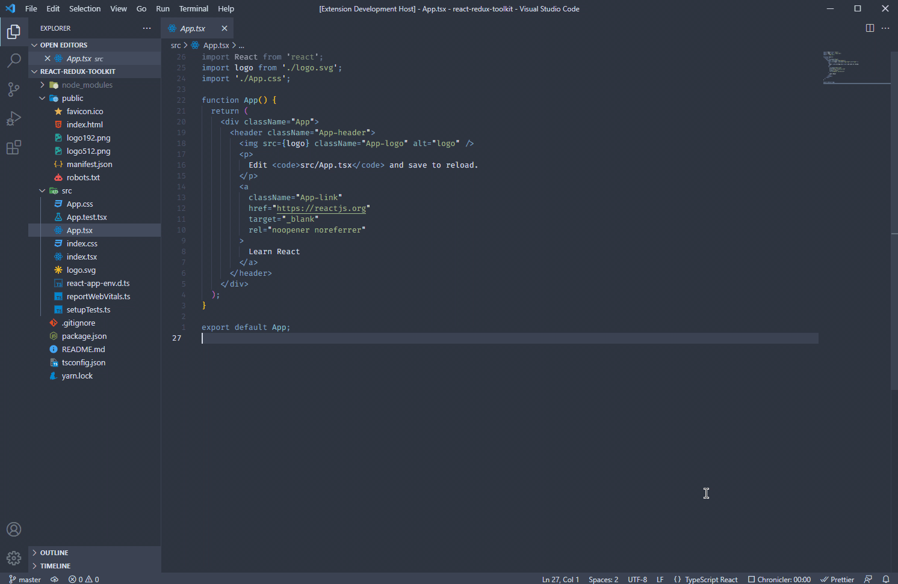

# {LazyR}😴

For **me** the **"Not Funny part"** when I start a new react project is the cleaning part.
and most of the developers are Lazy uncluding me 😂😂😂
so I created an extension to clean a new react project (you know ... automation power 💪💪💪 hahah)

## Demo

## Features
Until now the extension detect the template (js,ts) of the project and clean it depends on it...

## Future update

1. maybe I'll make it more generale ... so it works on any framework (i need to change the name to LazyGlobal 😂)
2. most of the time i use tailwindcss so maybe i'll add a command to install tailwind on an existing project
3. I NEED A LOGO 😂

**Enjoy and feel free to contribute !**
